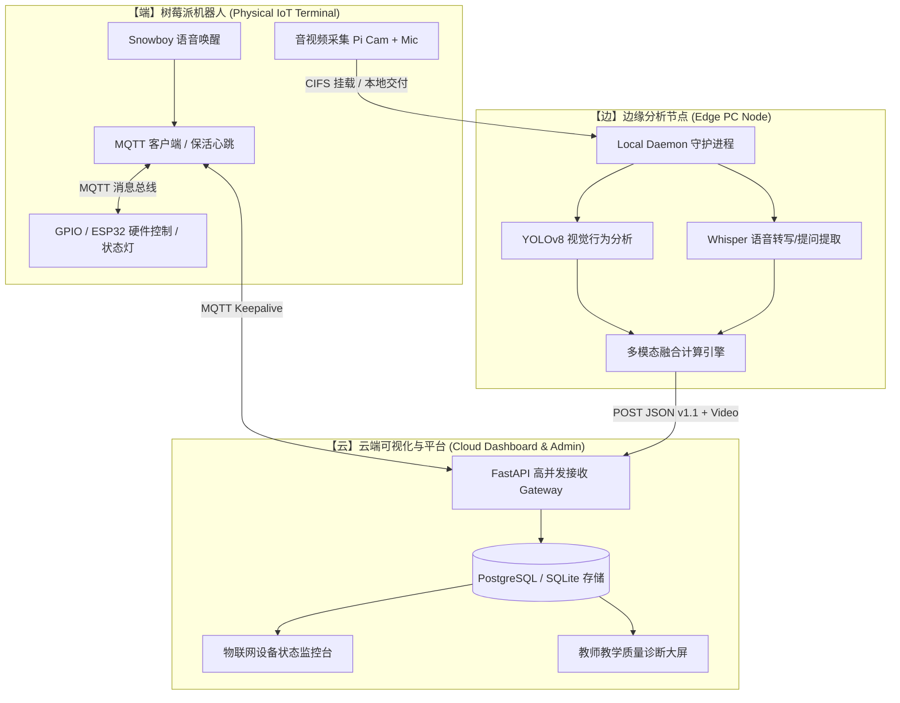

# 2026年第十届湖南省大学生物联网应用创新设计竞赛 — 参赛备赛与系统重构方案

> **项目名称**：课堂教育辅助机器人 (Class Assistant Robot)  
> **申报赛道**：创意赛（教育领域 / 智慧校园 / 大数据与AI在物联网中的应用）  
> **生成日期**：2026-07-24  
> **竞赛时间**：2026年9月19日 - 9月20日（湖南应用技术学院）  
> **材料提交窗口**：2026年8月20日 - 9月6日  

---

## 一、 竞赛官方通知核心要点梳理

### 1. 竞赛概况与时间节点
* **主办单位**：湖南省教育厅
* **承办单位**：湖南应用技术学院
* **关键时间节点**：
  * **初赛与网报窗口**：2026年8月20日 - 9月6日（提交至邮箱 `hunaniot@qq.com`）
  * **形式审查与复赛**：2026年9月初（专家会议评审，直接评定三等奖及入围决赛名单）
  * **现场决赛**：2026年9月19日 - 9月20日（现场实物演示 + 隐名答辩，决出一、二等奖）

### 2. 创意赛参赛硬性要求
* **实物演示要求**：作品必须为**可演示的实物系统**，决赛现场必须进行实物演示与现场答辩。
* **提交材料清单**：作品简介、功能需求说明、系统设计说明、演示文档（PPT）、演示视频、系统截图/图片、干净源程序、报名表扫描件（加盖学校公章）。
* **隐名答辩规定**：答辩过程中及所有提交的材料中，**严禁出现学校、团队名称、指导教师及队员姓名等敏感信息**，否则扣分或取消资格。
* **AI / 大模型工具声明**：若使用大模型等 AI 工具辅助开发，**必须说明人工智能工具在开发过程中所占比例**。
* **人员限制**：本科每校限 5 件作品；每队 1-3 名学生，1-2 名指导教师。

---

## 二、 官方评审维度与项目现状差距分析

评委会依据七大维度进行综合打分（满分 100 分），以下为项目现状与竞赛标准的对照与补强方案：

| 评审维度 (官方七项) | 竞赛评分关注点 | 项目现状差距与风险点 | 必须完成的针对性重改措施 |
| :--- | :--- | :--- | :--- |
| **1. 嵌入式软件开发与应用能力** | 边缘节点/单片机控制、实时性、稳定性 | 树莓派代码存在 `chat.py` 上帝函数，启动较脆弱，守护进程有报错循环 | 重构 Pi 端关键逻辑，确保脱网/局域网环境下一键稳定启动。 |
| **2. 信号采集与处理能力** | 传感器接口、音视频采集、数据平滑 | 已完成摄像头+麦克风采集，但环境传感器与外设交互被禁用 | 恢复 GPIO / 环境传感器 / 提示灯交互，增强物理感知能力。 |
| **3. 应用软件开发能力** | 云端 Web 界面、数据库、API 设计 | FastAPI 后台与 Dashboard 完整，但双评分体系（41.9分 vs 67.0分）混乱 | 统一云端评分模型，优化 Dashboard 动态视觉与交互体验。 |
| **4. 物联网系统集成设计能力** | 端-边-云架构、数字孪生、多节点协同 | 边缘与云端靠 HTTP 手动传 JSON，缺少设备管理与在线状态保活 | **引入 MQTT 保活心跳**，云端后台增加“物联网设备运行监控大屏”。 |
| **5. 无线通讯与自动识别** | Wi-Fi、蓝牙、WSN、MQTT 协议应用 | 早期 MQTT 控制代码被关闭，通信协议偏向普通 Web HTTP | **恢复 MQTT 协议栈**，展示“语音/AI 决策 ➔ MQTT 下发控制 ➔ ESP32/硬件响应”。 |
| **6. 创新创意与实践能力** | 多模态 AI 融合、真实场景落实 | YOLO + ASR 融合叙事性强，但无数据时默认填充 82 分兜底逻辑需修正 | 修正数据失真风险，准备真实课堂对比数据证明系统有效性。 |
| **7. 团队协作与答辩呈现** | 隐名合规、演示视频、现场答辩控场 | 暂未准备隐名版 PPT 与一镜到底视频 | 编制符合规范的无名版全套材料，录制“插电即用”一镜到底视频保底。 |

---

## 三、 “端-边-云”参赛系统架构强化图

---

## 四、 详细备赛实施计划（Roadmap & Timeline）

### 阶段一：系统硬核重改与稳定性提升 (7月25日 - 8月8日)
- [ ] **修复守护进程 Bug**：解决 `local_analysis_client` 报错与路径引用异常，确保边缘分析守护进程 100% 自动消费。
- [ ] **恢复 MQTT 物联网心跳**：
  - 树莓派与云端添加 MQTT 心跳上报机制。
  - 在云端 `/admin/ingestion` 后台增加 **“IoT 边缘设备实时在线监控面板”**。
- [ ] **优化云端大屏视觉 (Dashboard v1.1)**：
  - 修复双评分冲突，将 UI 卡片与 ECharts 细节打磨至“比赛级”。
  - 增加“曲线波谷与视频回放”联动功能。

### 阶段二：申报材料全套编制与隐名合规审查 (8月9日 - 8月19日)
- [ ] **撰写系统设计与需求说明书**：依据竞赛要求编排，删除所有个人与学校信息。
- [ ] **拍摄并制作演示视频**：录制 3-5 分钟“一镜到底”视频，展示物理设备交互、边缘计算与云端图表生成过程。
- [ ] **编制 AI 工具使用比例声明表**：按规定列明大模型（DeepSeek）、视觉模型（YOLOv8）、语音模型（Whisper）使用占比及团队自定义代码量。
- [ ] **彻底执行隐名审查**：检查 PPT、文档、视频字幕、源码中是否有学校/姓名水印。

### 阶段三：高校网报与学校盖章提交 (8月20日 - 8月31日)
- [ ] **官网注册与报名**：领队老师在 `http://www.hiotf.org.cn/` 完成学校账号注册。
- [ ] **公章盖印与邮件发送**：打印报名表盖章，将全套电子材料于 **9月5日前** 发送至组委会邮箱 `hunaniot@qq.com`。

### 阶段四：现场答辩与极客演示演练 (9月1日 - 9月18日)
- [ ] **现场便携展盒构建**：准备集成了树莓派、摄像头、便携热点、边缘 PC 的便携演示箱。
- [ ] **答辩演练**：1 名主讲队员进行 8 分钟极简答辩 + 演示演练，重点准备针对“IoT 属性”与“多模态算法”的专家质询预案。

---

## 五、 附件与备用材料模板

### 附件：人工智能工具使用比例声明表（模板）

| 模块类别 | 选用技术 / 工具 | AI 工具贡献比例 | 团队自主研发/集成贡献 |
| :--- | :--- | :--- | :--- |
| **语音自然交互** | SiliconFlow (DeepSeek-V3) | 30% (模型推理) | 70% (Prompt工程、流式TTS对接、状态机) |
| **视觉行为分析** | YOLOv8 开源目标检测 | 40% (基础权重) | 60% (注意力平滑算法、区域划定、举手统计) |
| **语音提问识别** | Faster-Whisper / Vosk | 30% (转录引擎) | 70% (提问提取规则引擎、时空对齐算法) |
| **系统综合占比** | **端-边-云系统整体** | **约 35%** | **约 65%** (架构设计、MQTT通信、FastAPI、ECharts大屏) |

---
