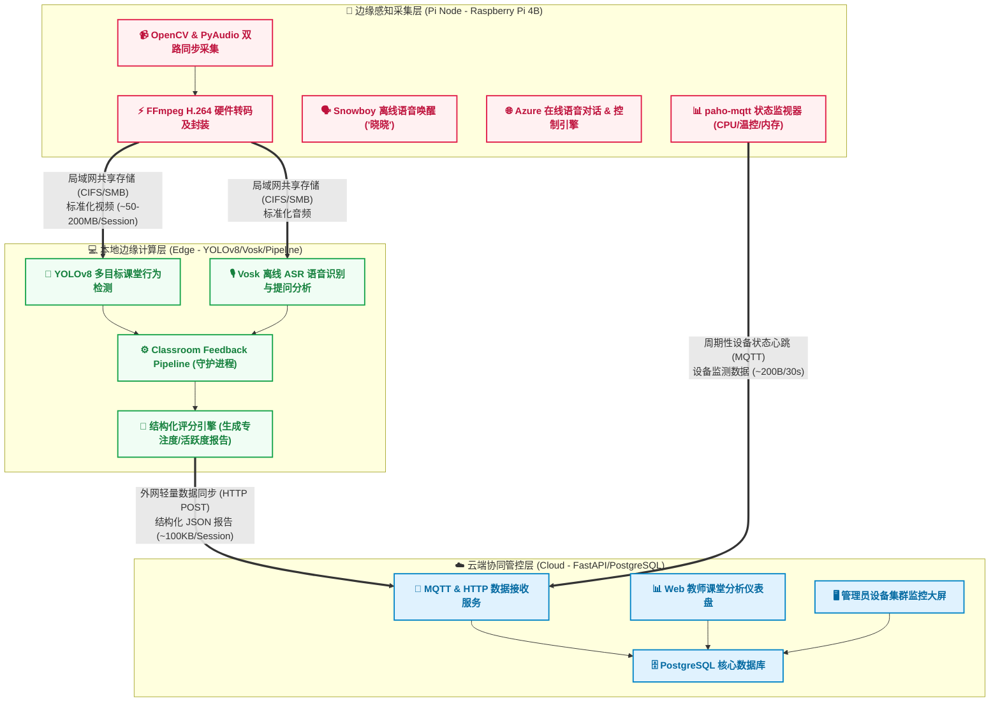

# 🏆 湖南省第十届大学生物联网应用创新设计竞赛

**作品名称**：边缘智能课堂行为分析与教学反馈系统  
**英文名称**：Edge-AI Classroom Behavior Analysis & Teaching Feedback System  
**参赛赛项**：创意赛 / 物联网技术在教育领域的应用  
**适用场景**：中小学及高校课堂教学质量评估、智慧教学督导、多教室设备运维管理  

---

## 📌 一、作品摘要

针对传统智慧教室“**视频公网上传带宽占用高、云端集中计算延迟大、学生人脸隐私数据易泄露**”等痛点，本作品设计并实现了一套**“端—边—云”三层协同的智慧课堂分析系统**。

*   **感知端**：采用树莓派 4B 搭载摄像头与麦克风，实现课堂音视频双路采集、FFmpeg 硬件转码及离线唤醒词语音交互，并通过 MQTT 协议周期性上报设备运行状态。
*   **边缘计算层**：部署 YOLO 行为检测模型与离线语音识别引擎，在局域网内完成学生抬头率、举手互动、教师提问频次等高算力推理，原始视频数据不出局域网。
*   **云端平台**：仅接收结构化分析报告，提供教师课堂复盘仪表盘与管理员设备集群监控大屏，支持横向扩展至多间教室统一管理。

本作品以“原始数据本地闭环分析 + 轻量报告云端汇聚”的设计，在保护师生隐私的前提下，为教学管理提供可量化的数据支撑。

## 🎯 二、立项背景与行业痛点

1.  **公网带宽与云计算成本高**：数十间教室的全天候视频若直接推流至云端，带宽与 GPU 算力成本将线性增长。
2.  **教学督导效率低**：传统方式依赖人工随机听课，采样率低、主观性强，难以形成全学期持续评估数据。
3.  **学生隐私保护需求**：课堂视频包含大量师生面部信息，原始视频频繁经公网传输存在隐私泄漏风险。
4.  **多教室设备运维盲区**：分散部署的采集终端缺乏集中状态监控与故障告警，异常响应滞后。

---

## 🏛️ 三、系统总体架构

本系统设计并实现了一套**“端—边—云”三层协同的智慧课堂分析系统**：

### 🔁 各层协作数据流说明

1.  **边缘感知采集层 (Pi Node)**：
    *   树莓派 4B 在教室内负责采集、硬件转码，并通过局域网共享目录 (CIFS/SMB) 将录制好的媒体文件输出到局域网存储中。
    *   树莓派不进行高负载行为分析推理，仅进行低算力本地语音控制 and 状态心跳上报。
2.  **本地边缘计算层 (Edge Server)**：
    *   局域网内的边缘服务器检测到新视频上传后，消费并运行 **YOLOv8**（分析学生抬头、举手、站立等行为）与 **Vosk**（离线转写文本、提取提问）。
    *   将多模态数据拟合，得出课堂综合评分和时间序列曲线，生成最终的轻量化 JSON 报告。
3.  **云端协同管控层 (Cloud Platform)**：
    *   云服务器接收到由边缘端发送的 JSON 报告进行持久化，不保存视频文件本身。
    *   为教师端展示课堂分析详情，同时收集并展示各个树莓派设备集群的心跳与运行状态。

## 🔥 四、核心创新点与技术特色

### 1. 边-端-云三层解耦架构
原始视频仅在局域网流转，云端只接收结构化 JSON（约 100 KB/session），公网带宽占用大幅降低。端侧本地推理不依赖云端，网络中断时采集不受影响，恢复后补传分析结果。

### 2. 多模态课堂行为分析
*   **视觉模态（YOLOv8）**：实时检测学生抬头听讲、举手互动、站立回答、低头受扰等多维行为，生成注意力曲线与区域分布热力图。
*   **听觉模态（离线 ASR）**：提取教师提问事件与互动时间戳，结合规则引擎计算课堂活跃度矩阵与教学阶段分布。
*   **五维评分模型**：综合注意力、活跃度、互动率、教学节奏、证据完整度，给出客观量化的课堂教学质量评分。

### 3. IoT 设备集群运维管理
*   **MQTT + HTTP 双通道心跳**：感知端每 30 秒上报 CPU 使用率、内存占用、磁盘剩余、CPU 温度至云端。主通道 MQTT，网络异常时自动降级为 HTTP，确保云端状态不丢失。
*   **多教室设备监控**：管理员 Web 端可统一查看所有采集终端的在线状态与健康指标，支持横向扩展到数十间教室。设备离线超 90 秒自动告警。
*   **虚拟仿真验证**：配合仿真节点模拟多教室并发场景，验证平台集群扩展能力。

### 4. 语音唤醒与自然交互
搭载 Snowboy 离线唤醒词引擎（唤醒词“晓晓”），支持 Azure 云端语音识别与合成，实现“唤醒→语音对话→控制录像”的自然交互流程。录像指令（开始/停止录像）本地硬编码匹配，响应稳定可靠。

---

## 💻 五、软硬件运行环境

| 模块 | 硬件配置 | 软件栈 |
| :--- | :--- | :--- |
| **感知端** | Raspberry Pi 4B (4GB), USB 摄像头, 麦克风 | Python 3.9+, OpenCV, PyAudio, FFmpeg, Snowboy, Azure SDK, paho-mqtt, psutil |
| **边缘计算端** | x86_64 工作站 / 笔记本 (NVIDIA GPU 可选) | Python 3.10+, PyTorch, YOLOv8, Vosk, FFmpeg, Loguru |
| **云端服务** | 云服务器 / 本地 PC (2核 4G+) | Python 3.10+, FastAPI, Uvicorn, PostgreSQL 14, ECharts |

## 🏆 六、应用价值与展示效果

1.  **教师课堂复盘**：每节课生成专注度/活跃度折线图、教学阶段饼图、区域表现柱状图、互动事件时间线，辅助教师精准改进教学方法。
2.  **教务数据决策**：为学校提供跨班级、跨学期的多维统计趋势与异常预警，取代传统人工抽查模式。
3.  **设备运维管理**：设备状态实时监控与离线告警，确保采集终端稳定运行，降低运维人力成本。
4.  **隐私合规保障**：原始视频不出局域网，云端仅存脱敏分析报告，符合教育场景数据安全要求。
5.  **低成本部署**：单教室前端硬件成本不足 400 元，兼容现有教室网络环境，具备规模化推广条件。
